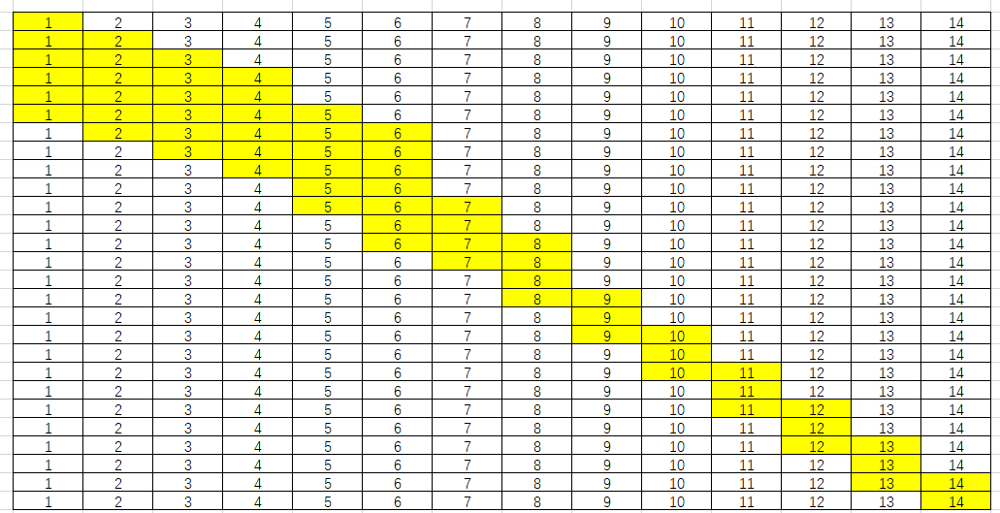

# # 一些很有用的思维方法与算法

---

- [function_1](function.c)

---
---

## (一) 尺取法

### 尺取法又称双指针法

- 顾名思义，像尺子一样取一段，借用挑战书上面的话说，尺取法通常是对**数组保存一对下标**，即**所选取的区间的左右端**点，**然后根据实际情况不断地推进区间左右端点**以得出答案。之所以需要掌握这个技巧，是因为尺取法比直接暴力枚举区间效率高很多，尤其是数据量大的。
- 这种方法很类似于==蚯蚓的蠕动==。
- 图大概是这样的：


---

### **case_1_[方生气](D:\_Learn_inNJU\1_1\10.3_for_while_arr\FUjiati/Angry_Fang.c)*

#### 题目描述`

方可元得到了员工们藏身的位置信息，有体力x点，他移动一格就会消耗一点体力，现在，他需要抓到最多的员工

#### 输入格式`

第一行，包含两个整数n（0<n<=10000），x（0<x<=10000），len（0<len<=10000）分别表示藏身的员工数和方总的体力以及街区的长度。 接下来n行，每行一个整数，表示第i个藏身的员工的位置。

#### 输出格式`

共两行，第一行包含两个整数，表示方可元从第几格走到第几格（第一格必须为员工的藏身点），第二行包含一个整数，表示抓到的员工数。

#### [MyCode](D:\_Learn_inNJU\1_1\10.3_for_while_arr\FUjiati/Angry_Fang.c)

---

### **case_2_[求和](D:\_Learn_inNJU\1_1\10.3_for_while_arr\FUjiati/Angry_Fang_help.cpp)*

#### 题目

给定一个数组和一个数s，在这个数组中找一个区间，使得这个区间之和等于s

- 如：数组int x[14] = {1, 2, 3, 4, 5, 6, 7, 8, 9, 10, 11, 12, 13, 14};和一个s = 15。那么，可以找到的区间就应该有0到4， 3到5， 6到7.（注意这里的下标从0开始）

**正常的思维**：

```C
//**先用一个数组sum[i]存放前i个元素的和，其实现用的是"递推思想"**
sum[0] = x[0];//x为给定的原数组
for(int i = 1; i < n; i++){
   sum[i] += sum[i-1];//递推思想
}
//**然后通过两层循环求解**
for(int i = 0; i < n; i++)
    for(int j = n-1; j >= 0; j--)
    {
        if(sum[j]-sum[i]==s)
            printf("%d---%d\n", i, j);
    }
```

- 那么，用"尺取法"做上面这道题思路应该是这样的：

1. 用一对脚标i, j。**最开始都指向第一个元素**。
2. **如果区间i到j之和比s小，就让j往后挪一位**，并把sum的值加上这个新元素。相当于蚯蚓的头向前伸了一下。
3. **如果区间i到j之和比s大，就让sum减掉第一个元素**。相当于蚯蚓的尾巴向前缩了一下。
4. 如果i到j之和刚好等于s，则输入。

用一张图来表示就是这样的，每一行的黄色部分代表本次循环选中的区间:
  

#### [other'sCode](D:\_Learn_inNJU\1_1\10.3_for_while_arr\FUjiati/Angry_Fang_help.cpp)

---
---

## (二) 背包

### - 给体积V的背包,有n种物品,每种物品有k[i]个,价值w[i],占空间v[i]

- 想法 给一个参数f[l],当我的体积为l的时候,我放还是不放这个物品i
- 实现

---

### **case_1_[背包0.1](D:/_Learn_inNJU/1_1/10.3_for_while_arr/FUjiati/caseProblem0.1.cpp)*

---

### **case_2_[背包1.0](D:\_Learn_inNJU\1_1\10.3_for_while_arr\FUjiati/caseProblem.c)*

#### 题目描述``

有 $N$ 件物品和一个容量为 $M$ 的背包。第 $i$ 件物品的重量是 $W_i$，价值是 $D_i$。求解将哪些物品装入背包可使这些物品的重量总和不超过背包容量，且价值总和最大。

#### 输入格式``

第一行：物品个数 $N$ 和背包大小 $M$。

第二行至第 $N+1$ 行：第 $i$ 个物品的重量 $W_i$ 和价值 $D_i$。

#### 输出格式``

输出一行最大价值。

- **样例输入 #1**

```C
4 6
1 4
2 6
3 12
2 7
```

- **样例输出 #1**

````c
23
````

#### [code](D:/.Professor/NJU/1_1/10.3_for_while_arr/FUjiati/caseProblem.c)

---
---

## (三) 关于周围的计数

### 想要统计$ a_{ij} $的周围

#### 想法: 定义一个$ vector_{ij} $表示上下左右或其他

---

- 如:表示上下左右可以:

```C
int vector[4][2] = {{0,1},{0,-1},{1,0},{-1,0}}; //即上下左右
//运用:
for(int i = 0;i<n;i++)
    for(int j = 0;j<m;j++)
      for(int k = 0;k<4;k++)
        cnt[i][j] += a[i+vector[k][0]][j+vector[k][1]];
```

---

- 如:表示前后各两个可以:

```C
int vector[4][2] = {{-2,0},{-1,0},{1,0},{2,0}}; //即前前后后
//运用:
for(int i = 0;i<n;i++)
    for(int j = 0;j<m;j++)
      for(int k = 0;k<4;k++)
        cnt[i][j] += a[i+vector[k][0]][j+vector[k][1]];
```

---

### **case_1_[扫雷](D:/.Professor/NJU/1_1/10.17_Loop/homework/code_teacher/Saolei.c)*

### **case_2_[数独](D:/.Professor/NJU/1_1/10.17_Loop/homework/code_teacher/Shudu.c)*

---
---

## (四)遍历与排他的思考

### ff

---
---

## (五)[DFS深度优先搜索算法](https://blog.csdn.net/weixin_43272781/article/details/82959089)

### 介绍

- 深度优先搜索算法（Depth First Search，简称DFS）：一种用于遍历或搜索树或图的算法。
- 沿着树的深度遍历树的节点，尽可能深的搜索树的分支。当节点v的所在边都己被探寻过或者在搜寻时结点**不满足条件**，搜索将回溯到发现节点v的那条边的起始节点。整个进程反复进行直到**所有节点**都被访问为止。
- 属于盲目搜索,最糟糕的情况算法时间复杂度为$O(n!)$。


```C
//伪代码
void dfs(int a,b,c,d){
如果满足条件，证明可行。
如果d超过k，终止。
dfs（a–＞b，d+1)
dfs（第二种）
dfs（第三到第六种）
}。
dfs初值：d=1，如果成功结束证明不可能
```

### case_1

### case_2

### case_3

---
---

## (六) 排序

### [菜鸟教程](https://www.runoob.com/w3cnote/ten-sorting-algorithm.html)


### [ver_n](hhh)

---

### [ver_00_猴子](Sort/sort_monkey.c)

### [ver_000_睡眠纯娱乐](Sort/sort_sleep.c)

- [记录时间](10.31_function_digui2.0/Fujiati/Luogu/cnt_time.c)

---

### [ver_0_选择](Sort/sort_select.c)

### [ver_1_冒泡](Sort/sort_buble.c)

### [ver_2_插入](Sort/sort_insert.c)


### [ver_2plus_希尔排序(非稳定)](Sort/sort_Shell.c)

- 可以理解成插入,从每次移一格的插入,变成每次移动x/2格,直到移动数为一格.

---

### [ver_3_归并](Sort/sort_Merge.c)


---

### [ver_4_快排](https://www.runoob.com/w3cnote/quick-sort-2.html) not code


#### [ver_4.1_二分快排他人](Sort/sort_quick.c)

#### [ver_4.2_二分快排助教思路](Sort/sort_really_quick.c)

---

### [ver_5_堆排序](Sort/sort_Heap.c)


---

### ver_6_非比较算法排序: 计数 桶 基数

#### [ver_6.1_计数排序](Sort/sort_cnt.c)

- 就是下标计数

#### [ver_6.2_桶排序](Sort/sort_box.c)

- 就是一个桶里面装的多一点


#### [ver_6.3_基数排序](Sort/sort_radix.c)

- 根据键值的每位数字来分配桶

---

### about qsort(!)

#### 函数原型

- `void qsort(void *base, size_t nitems, size_t size, int (*compar)(const void *, const void*))`

- one example for c [is sturct sort link](/NJU/1_1/11.07_Zhan_Fc/homework/tch/wine.c)
- another example for c [is int sort link](/NJU/1_1/11.21_point_2/class/function_call_back.c)
- another example for c [is char sort link](/NJU/1_1/SelfLearn/week13/qsort.c)

---
---

## （七）并查集 union find set

### 简介

- [link_1](https://blog.csdn.net/woshishuizzz/article/details/8460474)
- [link_2](https://blog.csdn.net/kobe_jr/article/details/106627359)

#### 基本操作

1. 合并两个集合union。
2. 判断两个元素是否在一个集合中find

#### 实现

1. 利用一个数组int father[N];其中父节点自身也在1-N之中
2. 用来记录父节点：即father[i]表示的i节点的父亲节点。当a和b的father[a]==father[b]时，a和b才是联通的。

#### 初始化

令father[] = -1(没有出现过的数字/或者i)

#### 示意图


#### 主要想法

findfather 函数 找到father
union 函数 用于合并

---

### [#case_1](https://www.luogu.com.cn/problem/P3367) 查并集模板

#### [code](/NJU/1_1/SelfLearn/week11/UFS_model.c)

### [#othrt case](/NJU/1_1/.%E6%9C%AC%E5%AD%A6%E6%9C%9F%E5%81%9A%E8%BF%87%E7%9A%84%E9%A2%98%E7%9B%AE.md)

---
