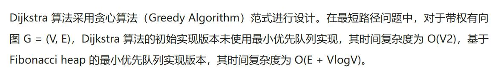

# 最短路径

---

## 传递闭包Warshall算法(DP)

- [离散Page19](/../OneDrive/%E7%A6%BB%E6%95%A3/PPT/14_%E5%85%B3%E7%B3%BB%E9%97%AD%E5%8C%85%E4%B8%8E%E7%AD%89%E4%BB%B7%E5%85%B3%E7%B3%BB-2023.pdf)

---

## 单源最短路径

---

### [Dijkstra 算法](https://www.imooc.com/article/28312)

- 点链接自己看看...

对于带权有向图 G = (V, E)，Dijkstra 算法要求图 G 中边的权值均为非负

点集$V$初始时候仅包含初始点$v$,每次包含一个不在内的与初始点$v$最短路径的点$a_i$,再由$a_i$发散一波,然后再包含....直到完全包含

---

### [Bellman-Ford 算法](https://zhuanlan.zhihu.com/p/72185593)

### [带权无向图最短Hamilton回路问题](https://zhuanlan.zhihu.com/p/315210267)

